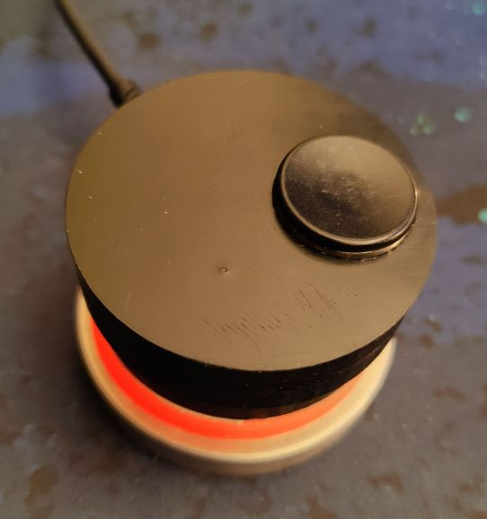
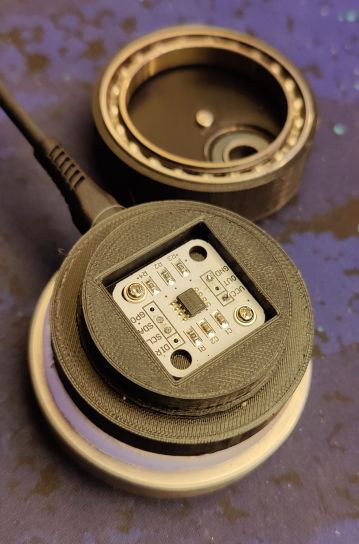

# jogwheel
Code and plans for a desktop jogwheel based on the qtpy rp2040 and an as6500 magnetic encoder

## Hardware

QT-Py RP2040 ~ $10 <https://www.adafruit.com/product/4900>
- Small
- usb-C
- runs circuitpython (and others)
- can emulate an HID device
- has built in neopixel and stemma qt connector

AS-5600 magnetic encoder ~ $3
- Cheap!
- no moving parts
   - can be completely sealed
- uses i2c
- be sure to get one already in i2c mode, otherwise, you may have to customize the board a bit

6808ZZ ball Bearing ~ $10
- I had one lying around
- Nice size for a jog wheel
- Makes for really smooth action
  - Good feel for video scrubbing if degreased
  - Good feel for volume knob with stock grease

Misc other parts
- 608 bearing
- 3d printed body
- some clear material for translucent base section (can be 3dp as well)
- heavy base for stability (I used stainless)
- stemma qt connector (optional, you can solder instead)
- misc wires and soldering equipment

## assembly

 
- solder leads to as5600 and screw it to the base
  - standard i2c connections: vcc, gnd, sda, scl
  - I used some m2.5 screws, anything will work including hot glue.
- connect up the controller
- test before you finish assembly
  - usb connector spacing
  - firmware installed
  - encoder detected and working
- final assembly
  - I ended up trimming the wires pretty short
  - make sure the LED is face down so the light will show up through the translucent base
  - I hot-glued the qtpy in place, which makes it pletty durable, but semi-permenent.

## software

I completely tore apart a micropython as5600 library at first, but then I figured out how to just grab position via i2c directly.  this makes it pretty responsive, though I'm sure there is room for improvement

Currently I have it set to change modes every time the magnet is too far away from the sensor.  my wheel is pretty loose, so it seemed like a pretty logical way to change modes without adding any more complexity or parts.

## 3d print files

Included are a base and a top, as well as a spinner handle

The top and base will need to be printed with aligned seams, and will need to be filed down until they are pretty flat.  I did this manually with both sandpaper and with a file, both worked fine.

see stl folder for models

I printed mine on a prusa mk2s, and they came out great.

